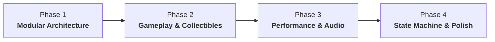

# Ninja Collector - Master Architecture & Optimization Roadmap

Welcome to the **Ninja Collector** project modernization and optimization roadmap. This document serves as the master index for all development phases, outlining architectural milestones, technical specifications, and implementation steps.

---

## 📌 Roadmap Overview



| Phase | Document | Focus Area | Key Deliverables |
| :--- | :--- | :--- | :--- |
| **Phase 1** | [Phase 1: Modular Architecture](file:///E:/Game%20Development/Python/GUVI-Pygame%20Game%20Dev/docs/phase-1-modular-architecture.md) | Code Organization & Engine Structure | Decouple `main.py`, create `src/` modules, centralized `config.py`, cached `AssetManager`. |
| **Phase 2** | [Phase 2: Gameplay & Collectibles](file:///E:/Game%20Development/Python/GUVI-Pygame%20Game%20Dev/docs/phase-2-gameplay-and-collectibles.md) | Game Loops & Mechanics | Animated Coin system (`coin1-7.png`), Hazard stars, HUD (Score & Lives), Group collision engine. |
| **Phase 3** | [Phase 3: Performance & Audio](file:///E:/Game%20Development/Python/GUVI-Pygame%20Game%20Dev/docs/phase-3-performance-and-audio.md) | Optimization & Sound | Delta-time (`dt`) movement, `bg1.png` downscaling & asset caching, `pygame.mixer` SFX & BGM. |
| **Phase 4** | [Phase 4: State Machine & Polish](file:///E:/Game%20Development/Python/GUVI-Pygame%20Game%20Dev/docs/phase-4-state-machine-and-polish.md) | Game Flow & Distribution | Scene Manager (Menu, Game, Pause, Game Over), High score persistence (`scores.json`), PyInstaller build. |

---

## 🏗️ Target Project File Structure

```
GUVI-Pygame Game Dev/
├── assets/
│   ├── images/
│   │   ├── player/           # Ninja1.jpg - Ninja5.jpg
│   │   ├── collectibles/     # coin1.png - coin7.png, star.png, star1.png
│   │   └── backgrounds/      # bg1_optimized.png
│   ├── audio/                # collect.wav, hit.wav, bgm.ogg
│   └── fonts/                # arcade_font.ttf
├── docs/
│   ├── README.md             # This master index
│   ├── phase-1-modular-architecture.md
│   ├── phase-2-gameplay-and-collectibles.md
│   ├── phase-3-performance-and-audio.md
│   └── phase-4-state-machine-and-polish.md
├── src/
│   ├── __init__.py
│   ├── config.py             # Global constants, colors, display settings
│   ├── asset_manager.py      # Pre-loader, surface scaling & caching
│   ├── entities/
│   │   ├── __init__.py
│   │   ├── player.py         # Player class with input & animations
│   │   ├── star.py           # Falling hazard stars
│   │   ├── coin.py           # Animated collectible coins
│   │   └── spawner.py        # Item wave & spawn manager
│   ├── scenes/
│   │   ├── __init__.py
│   │   ├── base_scene.py     # Base abstract scene interface
│   │   ├── menu_scene.py     # Title screen & instructions
│   │   ├── play_scene.py     # Core active gameplay scene
│   │   ├── pause_scene.py    # Pause overlay
│   │   └── game_over_scene.py# Game over & score summary
│   ├── ui/
│   │   ├── __init__.py
│   │   └── hud.py            # Score, lives & combo rendering
│   └── game.py               # Main Game Engine class
├── main.py                   # Clean application entry point (~15 lines)
└── requirements.txt          # Dependencies (pygame-ce / pygame)
```

---

## 🚀 Quick Links to Phase Details

* 📂 [Phase 1: Modular Architecture Specification](file:///E:/Game%20Development/Python/GUVI-Pygame%20Game%20Dev/docs/phase-1-modular-architecture.md)
* 📂 [Phase 2: Gameplay & Collectibles Specification](file:///E:/Game%20Development/Python/GUVI-Pygame%20Game%20Dev/docs/phase-2-gameplay-and-collectibles.md)
* 📂 [Phase 3: Performance & Audio Specification](file:///E:/Game%20Development/Python/GUVI-Pygame%20Game%20Dev/docs/phase-3-performance-and-audio.md)
* 📂 [Phase 4: State Machine & Polish Specification](file:///E:/Game%20Development/Python/GUVI-Pygame%20Game%20Dev/docs/phase-4-state-machine-and-polish.md)
