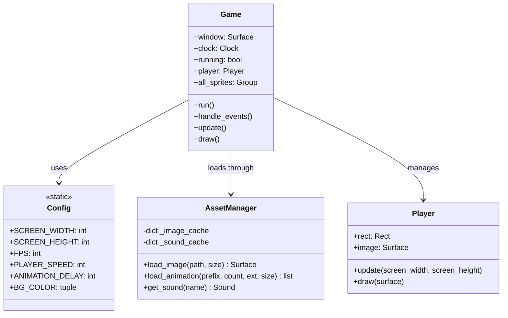

# Phase 1: Modular Architecture & Code Decoupling

## 1. Objective

Refactor the single monolithic script ([`main.py`](file:///E:/Game%20Development/Python/GUVI-Pygame%20Game%20Dev/main.py)) into a modular, clean, and extensible architecture. Separate configuration, asset management, entities, and the core game loop to adhere to single-responsibility principles.

---

## 2. Architectural Blueprint



---

## 3. Detailed Component Specifications

### 3.1 `src/config.py`
Extract all magic numbers and configuration settings:
* **Display Settings:** `DEFAULT_WIDTH = 800`, `DEFAULT_HEIGHT = 600`, `FPS = 60`, `CAPTION = "Ninja Collector"`.
* **Player Configuration:** `PLAYER_SPEED = 6`, `PLAYER_SIZE = (64, 64)`, `ANIMATION_DELAY = 100`.
* **Asset Paths:** Paths for textures, icons, fonts, and sound effects.

### 3.2 `src/asset_manager.py`
Centralized asset loading with caching to prevent redundant disk reads and surface transformations:
```python
import pygame
import os

class AssetManager:
    def __init__(self, base_dir="."):
        self.base_dir = base_dir
        self._image_cache = {}

    def load_image(self, filename, size=None):
        key = (filename, size)
        if key not in self._image_cache:
            path = os.path.join(self.base_dir, filename)
            surface = pygame.image.load(path).convert_alpha()
            if size:
                surface = pygame.transform.scale(surface, size)
            self._image_cache[key] = surface
        return self._image_cache[key]
```

### 3.3 `src/entities/player.py`
Decouple [`Player`](file:///E:/Game%20Development/Python/GUVI-Pygame%20Game%20Dev/main.py#L4-L69) from `main.py`:
* Pure entity logic with input handling, boundary clamping, and directional flipping.
* Consumes animation surfaces provided by `AssetManager`.

### 3.4 `src/game.py` & `main.py`
* Encapsulates the Pygame window lifecycle, clock tick management, event dispatching, and scene orchestration within a dedicated `Game` engine class.
* Reduces `main.py` to a clean ~15 line entry point:
```python
import pygame
from src.game import Game

def main():
    game = Game()
    game.run()

if __name__ == "__main__":
    main()
```

---

## 4. Implementation Checklist

- [x] Create directory structure `src/`, `src/entities/`, `src/scenes/`, `src/ui/`.
- [x] Implement `src/config.py` with default resolutions, frame rate, and asset directories.
- [x] Implement `src/asset_manager.py` with surface caching.
- [x] Migrate `Player` to `src/entities/player.py`.
- [x] Migrate `StarSprite` to `src/entities/star.py`.
- [x] Implement `src/game.py` containing the main game loop and event handling.
- [x] Refactor root `main.py` to import and execute `Game.run()`.
