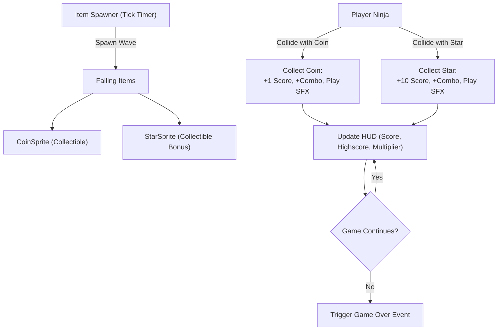

# Phase 2: Gameplay Mechanics & Collectibles System

## 1. Objective

Transform the prototype into a complete, engaging arcade game by activating unused visual assets (`coin1.png` to `coin7.png`), establishing clear gameplay rules (collectibles vs. hazards), implementing an animated coin collection system, and integrating a full Heads-Up Display (HUD).

---

## 2. Gameplay Loop & Entity Interactions



---

## 3. Component & Feature Specifications

### 3.1 Animated Coin Sprite (`src/entities/coin.py`)
Utilize the 7 coin frames (`coin1.png` through `coin7.png`) to create a smooth rotating coin animation:
* **Animation Cycle:** 70ms per frame cycling through `coin1.png` to `coin7.png`.
* **Value & Points:** Standard coins yield +1 point each. Rare/golden variants can yield bonus score.
* **Movement:** Moves downward at random speeds (e.g., 2.0 to 4.5 px/frame).

```python
class CoinSprite(pygame.sprite.Sprite):
    def __init__(self, frames, x, y, speed=3.0, value=1):
        super().__init__()
        self.frames = frames
        self.current_frame = 0
        self.image = self.frames[0]
        self.rect = self.image.get_rect(center=(x, y))
        self.pos_y = float(self.rect.y)
        self.speed = speed
        self.value = value
        self.animation_delay = 70
        self.last_update = pygame.time.get_ticks()

    def update(self, screen_height):
        # Move downward
        self.pos_y += self.speed
        self.rect.y = int(self.pos_y)
        
        # Frame animation
        now = pygame.time.get_ticks()
        if now - self.last_update > self.animation_delay:
            self.current_frame = (self.current_frame + 1) % len(self.frames)
            self.image = self.frames[self.current_frame]
            self.last_update = now
```

### 3.2 Bonus Star System (`src/entities/star.py`)
* Stars are collectible bonus pickups, not hazards.
* Collecting a star adds +10 points and can contribute to the player's current combo/multiplier.
* Bombs remain the hazard object in the gameplay loop.

### 3.3 Dynamic Spawner (`src/entities/spawner.py`)
* Automatically spawns coins and bonus stars above the screen (`y = -50`) at random X positions across screen width.
* Progressive Difficulty: Decreases spawn intervals and increases item drop velocity as the player's score rises.

### 3.4 Heads-Up Display HUD (`src/ui/hud.py`)
* **Score Display:** Top-left rendered score with smooth count-up.
* **Lives Indicator:** Ninja icons or heart symbols representing remaining player health (e.g., 3 lives).
* **Combo Multiplier:** Consecutive coin pickups without taking damage increase the score multiplier (1x -> 2x -> 3x).

---

## 4. Implementation Checklist

- [ ] Implement `src/entities/coin.py` loading `coin1.png` through `coin7.png`.
- [ ] Refactor `src/entities/star.py` with collectible bonus behavior and +10 score value.
- [ ] Create `src/entities/spawner.py` for timed wave generation across the screen width.
- [ ] Implement `src/ui/hud.py` rendering score, high score, and remaining lives using `pygame.font`.
- [ ] Integrate group collision handling (`pygame.sprite.spritecollide`) in the main game loop.
- [ ] Implement player invulnerability frames for damage from bomb hits only.
