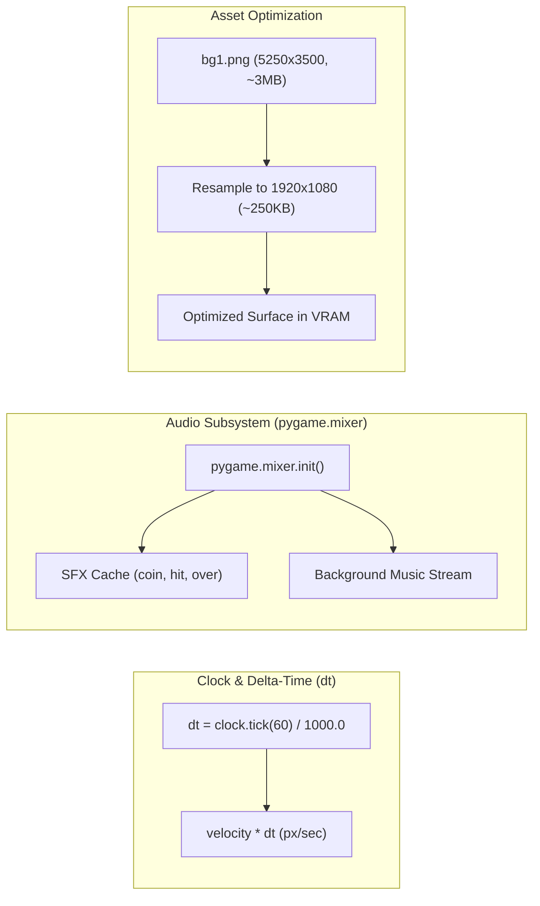

# Phase 3: Performance, Rendering & Audio Optimization

## 1. Objective

Eliminate performance bottlenecks, optimize memory consumption, make movement velocity independent of frame rates using delta-time (`dt`), and integrate immersive audio feedback (SFX and background music) via `pygame.mixer`.

---

## 2. Optimization Architecture & Delta Time



---

## 3. Detailed Technical Specifications

### 3.1 Background & Asset Optimization
* **Problem:** `bg1.png` is 5250 × 3500 pixels (2.88 MB). Every window resize event executes `pygame.transform.scale()` on this massive bitmap, causing severe CPU spikes and frame stutter.
* **Solution:** 
  1. Downsample the source image to a maximum target resolution (e.g. 1920×1080).
  2. Cache scaled variations of the background per resolution instead of re-transforming every resize tick.

### 3.2 Delta-Time Movement Physics (`dt`)
Transition from fixed pixel-per-frame updates to frame-rate-independent physics:
```python
# Game loop
dt = clock.tick(FPS) / 1000.0  # seconds elapsed since last frame

# Entity kinematics
class Player:
    def __init__(self):
        self.speed = 360  # pixels per second (instead of 6 px/frame)

    def handle_input(self, dt):
        keys = pygame.key.get_pressed()
        dx, dy = 0, 0
        if keys[pygame.K_LEFT] or keys[pygame.K_a]:
            dx -= self.speed * dt
        if keys[pygame.K_RIGHT] or keys[pygame.K_d]:
            dx += self.speed * dt
        self.pos_x += dx
        self.rect.x = int(self.pos_x)
```

### 3.3 Audio System (`src/audio_manager.py`)
Centralized sound manager utilizing `pygame.mixer`:
* **Sound Effects (SFX):**
  * `coin_pickup.wav`: High-pitched chime on coin collection.
  * `ninja_hit.wav`: Impact sound on obstacle collision.
  * `game_over.wav`: Stinger when all lives are depleted.
* **Music (BGM):**
  * Looping 8-bit/arcade ninja theme music playing at 50% volume.
* **Audio Controls:**
  * Mute toggle (<kbd>M</kbd> key) and volume slider support.

---

## 4. Implementation Checklist

- [ ] Downscale `bg1.png` using a Python script / PIL to 1920×1080.
- [ ] Refactor game loop to calculate and pass delta-time `dt` to all `.update(dt)` entity methods.
- [ ] Update `Player`, `CoinSprite`, and `StarSprite` kinematics to use pixels-per-second scaling.
- [ ] Initialize `pygame.mixer.init()` with optimized buffer settings (`buffer=512`).
- [ ] Implement `src/audio_manager.py` with volume control and sound caching.
- [ ] Wire audio triggers into coin collection, star collisions, and game over states.
