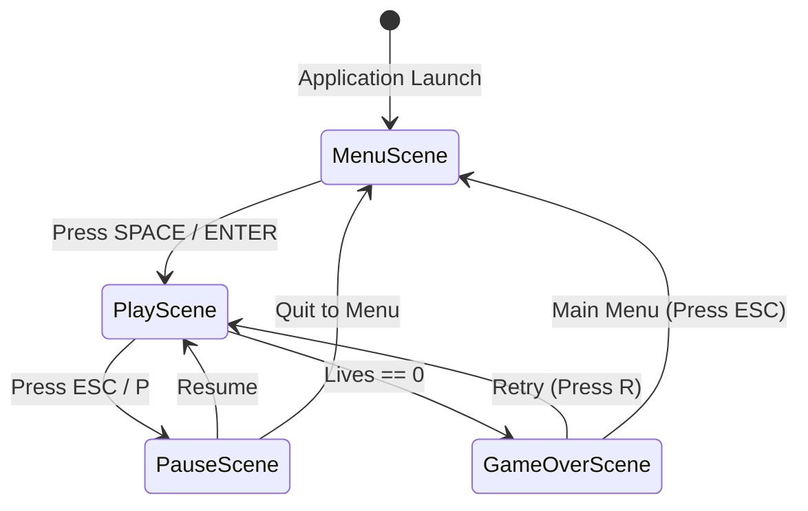

# Phase 4: Scene State Machine, Persistence & Polish

## 1. Objective

Implement a structured Scene State Machine to manage game lifecycle transitions (Main Menu, Active Gameplay, Pause, and Game Over screens), introduce high score persistence to disk, add visual polish (particle effects, screen shake), and prepare the project for standalone distribution.

---

## 2. Scene State Machine Architecture
 


---

## 3. Detailed Component Specifications

### 3.1 Scene Management (`src/scenes/`)
* **`BaseScene`:** Abstract class defining required methods:
  * `handle_event(event)`
  * `update(dt)`
  * `draw(surface)`
* **`SceneManager`:**
  * Maintains the active scene stack.
  * Transitions smoothly between scenes with optional fade-in / fade-out animations.

```python
class BaseScene:
    def __init__(self, game):
        self.game = game

    def handle_event(self, event):
        pass

    def update(self, dt):
        pass

    def draw(self, screen):
        pass
```

### 3.2 High Score Persistence (`src/data_manager.py`)
* Automatically saves top scores to a local JSON file (`data/highscores.json`).
* Loads previous best records on launch and checks for new high scores on the Game Over screen.

### 3.3 Visual Polish & Game Feel (Juice)
* **Particle System (`src/entities/particles.py`):**
  * Gold sparkle burst upon collecting a coin.
  * Shrapnel / smoke puff upon taking damage from a star.
* **Camera / Screen Shake:**
  * Subtle 3-frame screen displacement when the player takes damage to enhance impact.
* **Animated UI Elements:**
  * Pulsing "Press SPACE to Start" text on the main menu.
  * Combo text popup floating above the player's head (+100! 2x COMBO).

### 3.4 Packaging & Distribution
* Add clean `requirements.txt` (`pygame>=2.5.0`).
* Create a PyInstaller spec file or build script to bundle the game into a standalone `.exe` without requiring Python to be pre-installed by end users.

---

## 4. Implementation Checklist

- [ ] Implement `BaseScene` interface and `SceneManager` in `src/scenes/`.
- [ ] Build `MenuScene` with title art and interactive start prompts.
- [ ] Build `PauseScene` with continue / quit options.
- [ ] Build `GameOverScene` showing final score, high score, and replay prompts.
- [ ] Create `src/data_manager.py` with JSON read/write persistence for high scores.
- [ ] Implement `ParticleSystem` for coin pickup and hit effects.
- [ ] Create `requirements.txt` and write PyInstaller packaging script.
